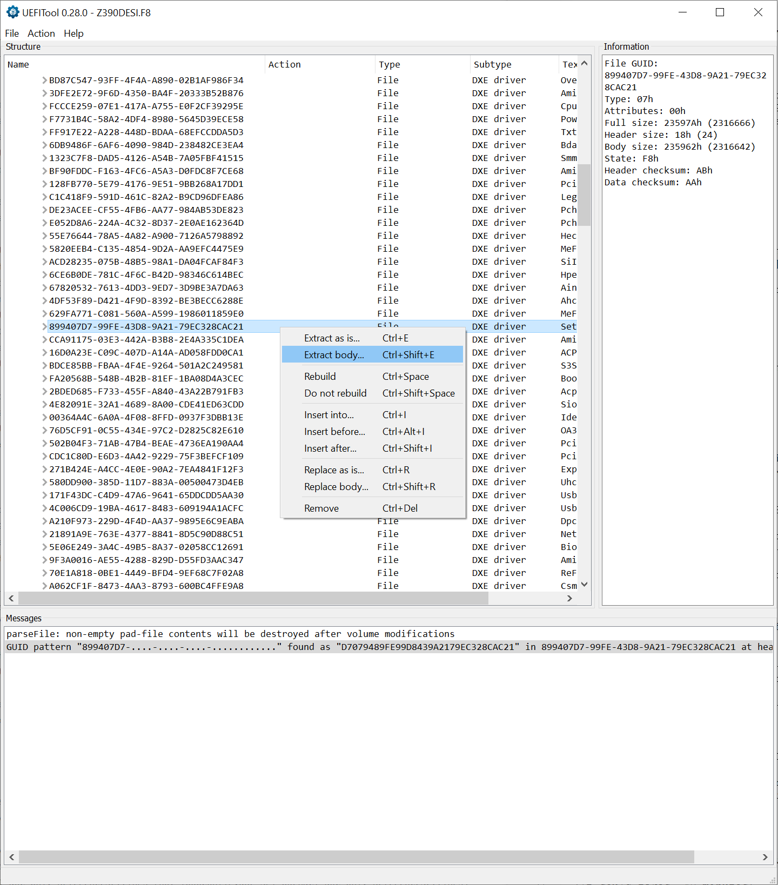
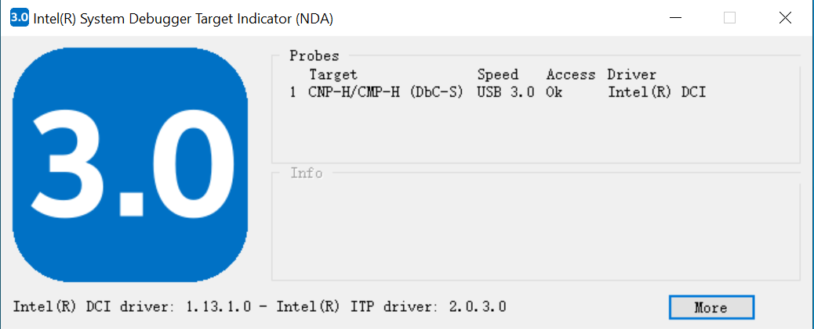
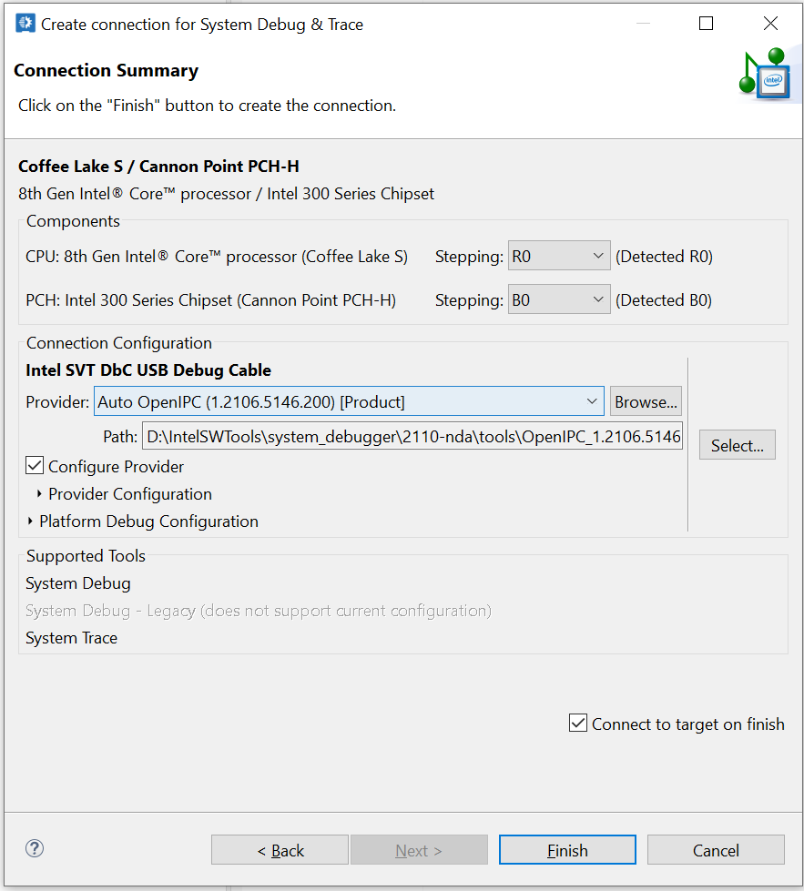
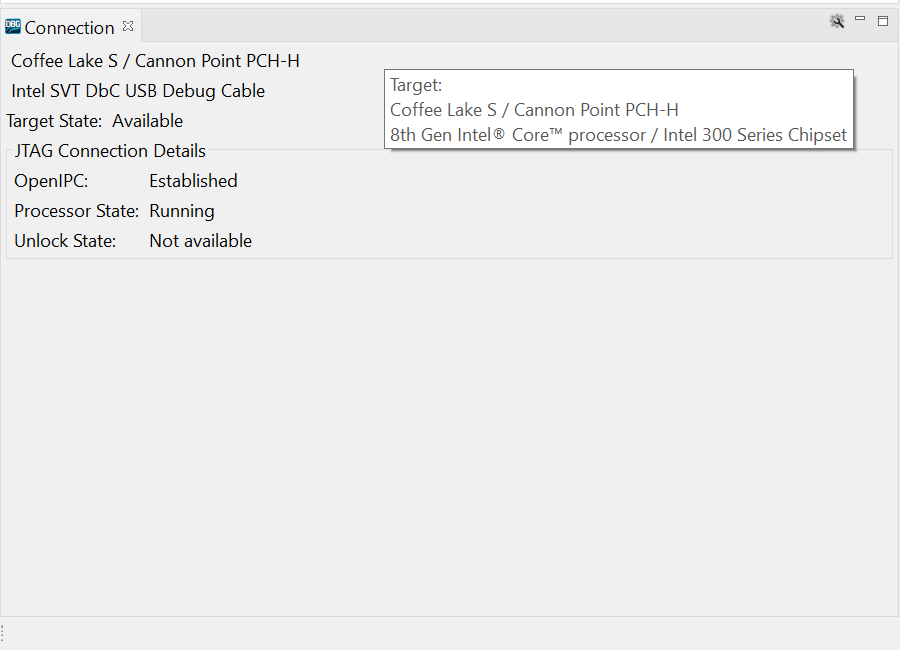
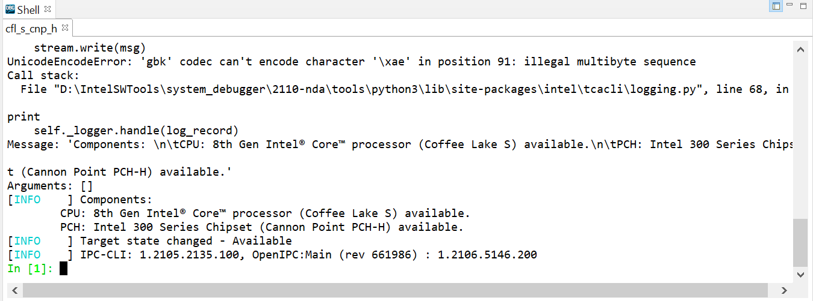

# Debug x86/x64 testbed via Intel Direct Connect Interface (DCI)
## 1. Hardware requirements:
Host PC: Win10 x64, USB 3.0 ports, Intel System Debugger NDA U2110.

Target PC: Gigabyte Z390 Designare (bios: [mb_bios_z390-designare_f8](mb_bios_z390-designare_f8.zip)), i9 9900K, USB 3.0 ports (I did not try USB 3.1 and so on)

[USB 3.0 debug cable](https://www.datapro.net/products/usb-3-0-super-speed-a-a-debugging-cable.html)

## 2. Prepare the target PC
(1) Flash the f8 bios, set "xHCI Hand-off" to be "Enabled"

(2) On the host PC, run [UEFITool](https://codeload.github.com/LongSoft/UEFITool/zip/refs/tags/A58) and open the bios image "Z390DESI.F8". Under the File menu, click Search and search GUID: 899407D7-99FE-43D8-9A21-79EC328CAC21. This is the "Setup" UEFI variable. Right click the section and select "Extract Body", save the section to a new file "section.bin".


(3) On the host PC, run [IFRExtractor](https://github.com/LongSoft/Universal-IFR-Extractor/releases/download/v0.3.6/IRFExtractor_0.3.6_win.zip), open "section.bin" and export the human readable variable options "section IFR.txt" in the same folder.

(4) On the host PC, open "section IFR.txt" and find the following variables, their offsets, and values that should be picked. My example is as follows:

```
1. Platform Debug Consent   					offset:0x10d5    	set to 3
2. USB3 Type-C UFP2DFP Kernel/Platform Debug Support		offset:0xa0b    	set to 1
3. USB Overcurrent Override for DbC      			offset:0xa0c    	set to 1
	- Set {0A 82} to 0
4. CPU Run Control						offset:0x65f    	set to 1
5. CPU Run Control Lock						offset:0x660    	set to 0
6. Enable/Disable IED (Intel Enhanced Debug)			offset:0x8ec    	set to 1
7. xDCI Support							offset:0xa43    	set to 1
```

Especially, {0A 82} is due to the description "Suppress If {0A 82}" in the file "section IFR.txt". The referred document 1 says that "There might also be a section around these variables that you need to take into account: If there is i.e.: "Suppress If {0A 82}" , then you also have to memorize that address, it needs to be set so that the Debug variables are initialized: 0xa82 leads to VarStore and the definition of it shows "enabed if 1", therefore it later has to be set to "0""

(5) Create a UEFI boot flash drive with ["ru.efi"](https://github.com/JamesAmiTw/ru-uefi/). One needs to format the flash drive with FAT32, make directory "efi/boot" and rename "ru.efi" to be "Bootx64.efi". We use this software to modify the BIOS image on the target PC.


(6) (Re-)Boot the target PC, run the renamed "ru.efi" from the flash drive. Use "pgdown" "pgup" to navigate UEFI variables and find the varible "Setup". Then we use "ctrl-pgdown" "ctrl-pgup" to access its content. This variable is 0x1xxx in size. Use the offset and values we found earlier to modify the content here. Use ctrl+w to save. Press alt+F to go to menus and quit after modifications are done.

(7) Reboot and connect the debug cable. The host PC must connect the cable via a native USB connection. That is, the connection starts from the host's USB port and ends on the target's USB. USB muxes/re-timers/repeaters/hubs are not recommended to exist in the path. In my test, going through USB hubs causes connection problems.


## 2. Run Intel System Debugger on host PC
(1) Run "Intel System Debugger Target Indicator 2021 NDA U2110", check if the connection is good. A good connection looks like this:


(2) Run Intel System Debugger. First click the "New Connection" dropbox 


Then select "Connect and detect target". Use default settings and then click "Finish"


Now the connection panel shows this:


Example shell output is:

```
[INFO    ] Using workspace directory 'E:/workspaces/system_debugger/workspace/isd_cli/8ff45f4c-3686-49dc-b3dc-17c877f6eb
62' for console session

Welcome to the Intel(R) System Debugger CLI
        Python   (v3.6.10) 'D:\IntelSWTools\system_debugger\2110-nda\tools\python3\python.exe'
        IPython  (v7.13.0)
        colorama [Loaded]

Modules:
        isd          - Intel(R) System Debugger CLI (v3.0.4673) [Loaded]
        tca          - Target Connection Assistant CLI (v3.0.4673) [Loaded]
        ipccli       - OpenIPC CLI (v1.2105.2135.100) [Loaded]
        sysdbg       - System Debug CLI (v1.21074+86b32) [Loaded]
        trace        - System Trace CLI (v1.2107.1906.200) [Loaded]
        crashlog     - Intel(R) Crash Log Framework (v3.42.21084.200) [Loaded]
        trace_agent  - System Trace Target Agent CLI [Loaded]


[INFO    ] OpenIPC configuration 'CFL_CNP_DCI_USB'; probe plug-in(s): 'OpenDCI'
[INFO    ] DCI: A DCI device has been detected, attempting to establish connection
[INFO    ] DCI: Target connection has been fully established
[INFO    ] Added new debug port 0 using probe plug-in 'OpenDCI'
[INFO    ] Detected CNP B0 (H) on JTAG chain 0 at position 0
[INFO    ] Detected CFL_M_UC R0 on JTAG chain 1 at position 0
[INFO    ] Target state changed - Checking Target
--- Logging error ---
Traceback (most recent call last):
  File "D:\IntelSWTools\system_debugger\2110-nda\tools\python3\lib\logging\__init__.py", line 996, in emit
    stream.write(msg)
UnicodeEncodeError: 'gbk' codec can't encode character '\xae' in position 119: illegal multibyte sequence
Call stack:
  File "D:\IntelSWTools\system_debugger\2110-nda\tools\python3\lib\site-packages\intel\tcacli\logging.py", line 68, in _
print
    self._logger.handle(log_record)
Message: 'Trying to map detected components to targets: 8th Gen Intel? Core? processor (Coffee Lake S) R0, Intel 300 Ser
ies Chipset (Cannon Point PCH-H) B0'
Arguments: []
--- Logging error ---
Traceback (most recent call last):
  File "D:\IntelSWTools\system_debugger\2110-nda\tools\python3\lib\logging\__init__.py", line 996, in emit
    stream.write(msg)
UnicodeEncodeError: 'gbk' codec can't encode character '\xae' in position 149: illegal multibyte sequence
Call stack:
  File "D:\IntelSWTools\system_debugger\2110-nda\tools\python3\lib\site-packages\intel\tcacli\logging.py", line 68, in _
print
    self._logger.handle(log_record)
Message: "Detected known target 'Coffee Lake S / Cannon Point PCH-H' with components: 8th Gen Intel? Core? processor (Co
ffee Lake S) R0 and Intel 300 Series Chipset (Cannon Point PCH-H) B0"
Arguments: []
[INFO    ] Detected known target 'Coffee Lake S / Cannon Point PCH-H' with components: 8th Gen Intel? Core? processor (C
offee Lake S) R0 and Intel 300 Series Chipset (Cannon Point PCH-H) B0
--- Logging error ---
Traceback (most recent call last):
  File "D:\IntelSWTools\system_debugger\2110-nda\tools\python3\lib\logging\__init__.py", line 996, in emit
    stream.write(msg)
UnicodeEncodeError: 'gbk' codec can't encode character '\xae' in position 91: illegal multibyte sequence
Call stack:
  File "D:\IntelSWTools\system_debugger\2110-nda\tools\python3\lib\site-packages\intel\tcacli\logging.py", line 68, in _
print
    self._logger.handle(log_record)
Message: 'Components: \n\tCPU: 8th Gen Intel? Core? processor (Coffee Lake S) available.\n\tPCH: Intel 300 Series Chipse
t (Cannon Point PCH-H) available.'
Arguments: []
[INFO    ] Components:
        CPU: 8th Gen Intel? Core? processor (Coffee Lake S) available.
        PCH: Intel 300 Series Chipset (Cannon Point PCH-H) available.
[INFO    ] Target state changed - Available
[INFO    ] IPC-CLI: 1.2105.2135.100, OpenIPC:Main (rev 661986) : 1.2106.5146.200
In [1]: 
```

And see 


(3) Then create a new debug configuration, see the [link](https://software.intel.com/content/www/us/en/develop/documentation/system-debug-user-guide/top/intel-system-debugger-startup/launching-the-debugger.html)

(4) Now one can debug the system, see the [link](https://software.intel.com/content/www/us/en/develop/documentation/system-debug-user-guide/top/debugging-basics.html)


## Related documents (Good to read)
1. https://gist.github.com/eiselekd/d235b52a1615c79d3c6b3912731ab9b2

2. https://www.programmersought.com/article/77321311295/
